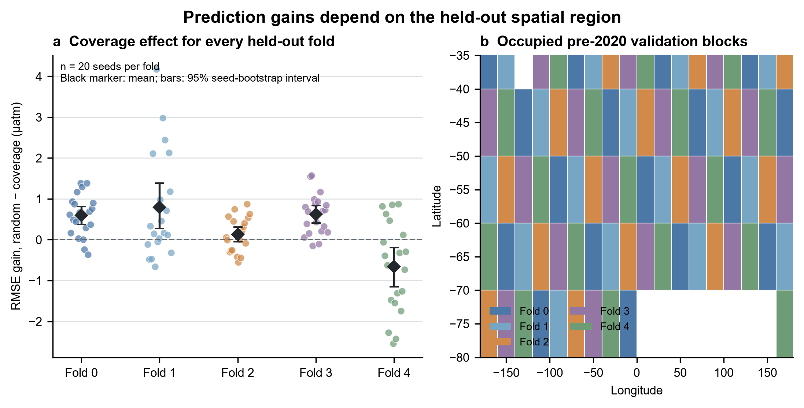
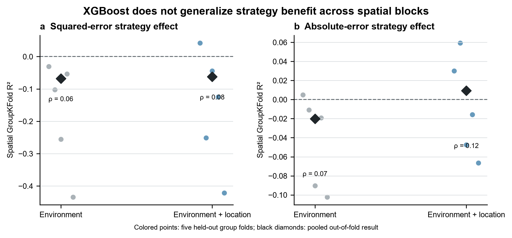
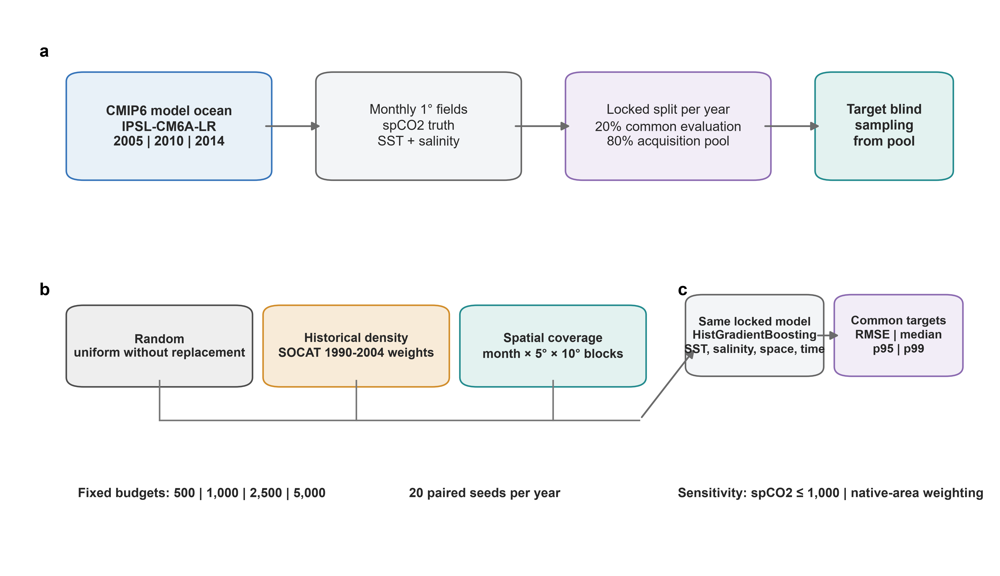
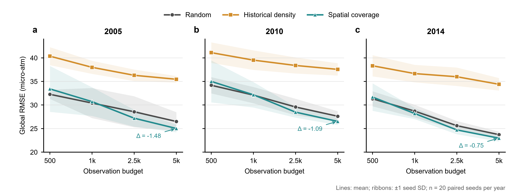
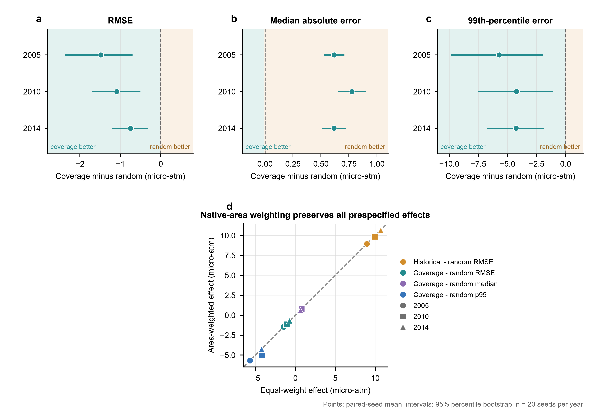

# Ocean Carbon Sampling

An independent, reproducible study of how fixed-budget sampling strategies affect out-of-sample reconstruction of Southern Ocean surface-ocean fCO2, followed by a global observing-system simulation experiment (OSSE) and an interactive web application.

This project is inspired by a collaborative course project in EESC/STAT 4243. The research question, experiment design, validation framework, implementation, and analyses in this repository are being independently redesigned.

## Research question

Under the same observation budget, which strategy improves blocked out-of-sample fCO2 prediction most efficiently?

- random sampling;
- densifying historically sampled regions;
- expanding spatial coverage;
- uncertainty-and-diversity-guided sampling.

## Regional validation result



Across all five prespecified spatial holdouts and 20 sampling seeds per fold,
coverage sampling improved geographic balance in 100/100 fold-seed combinations.
Predictive gains were heterogeneous: four fold means favored coverage, three
fold-specific seed intervals were entirely above zero, and fold 4 favored random
sampling (mean RMSE gain −0.661 µatm; 95% seed-bootstrap interval −1.149 to
−0.192).

The defensible conclusion is therefore not that geographic coverage is always
superior, but that it reliably changes the sampling geometry and often improves
prediction depending on the held-out region. See
[`docs/spatial_sensitivity_results.md`](docs/spatial_sensitivity_results.md) for
the full result and interpretation boundary.

## Explainability gate



We tested whether environmental and geographic features could predict the
observation-level benefit of coverage sampling in unseen spatial blocks. The
diagnostic XGBoost models did not pass the prespecified grouped-validation gate:
the primary squared-error target had negative pooled out-of-fold R² for both
feature sets, and rank correlations were weak. SHAP values are therefore
withheld from the public interpretation rather than presented as scientific
drivers. See [`docs/diagnostic_results.md`](docs/diagnostic_results.md) for the
validation metrics and decision rule.

## Global OSSE figure drafts

> **Draft visual layer.** These figures preserve the verified analysis and
> panel content, but their layout, typography, and legends are not final
> portfolio graphics. All source tables are retained for a later redesign.







The locked global OSSE separates sampling geometry from sample count: each
strategy receives the same observation budget, uses the same reconstruction
model, and is evaluated against complete model truth. Under a month-stratified
random hidden-cell evaluation, spatial-coverage sampling lowers RMSE and severe
tail error in 2005, 2010 and 2014 at the largest budget, while slightly
increasing median absolute error. A stricter 2005 spatial-block holdout gate
leaves whole 20° × 10° regions unseen during training. There, coverage improves
RMSE in only two of five folds and has a fold-average effect of +1.609 µatm
(positive means worse than random). The scientific result is therefore a
context-dependent redistribution of error—not the trivial claim that more
observations improve prediction, and not evidence that coverage is universally
superior. Full, source-grounded
draft captions and interpretation limits are provided in
[`docs/osse_portfolio_figure_legends.md`](docs/osse_portfolio_figure_legends.md).
The rerunnable narrative is available in
[`notebooks/published/osse_results_walkthrough.ipynb`](notebooks/published/osse_results_walkthrough.ipynb),
with a map-first visual demo in
[`notebooks/published/osse_visual_story_demo.ipynb`](notebooks/published/osse_visual_story_demo.ipynb),
and the exact redraw inputs are listed in
[`docs/osse_figure_data_inventory.md`](docs/osse_figure_data_inventory.md).

## Project stages

1. **Regional minimum experiment** — SOCAT v2025, Southern Ocean, random versus coverage sampling.
2. **Regional benchmark** — all strategies, repeated seeds, temporal and spatial holdouts, probabilistic evaluation.
3. **Global OSSE** — subsample an Earth system model field using SOCAT-like masks and compare reconstructions with model truth.
4. **Interactive application** — explore observations, sampling choices, learning curves, and calibration.

## Repository policy

The repository intentionally excludes raw data, working notebooks, trained models, caches, logs, and uncurated experiment outputs. Only reusable source code, configuration, tests, a small demo dataset, published notebooks, and curated public results belong in Git.

## Quick start

```bash
python -m venv .venv
pip install -e ".[dev,model,osse,app,notebook]"
pytest
```

Data are not downloaded automatically. See [`data/README.md`](data/README.md) and the SOCAT data-use statement before running experiments.

Run the reproducible data audit, minimum experiment, and repeated-seed benchmark
after placing the SOCAT CSV at the configured raw-data path:

```bash
python scripts/make_data_audit.py data/raw/socat/SOCATv2025_tracks_gridded_monthly.csv
python scripts/run_minimal_experiment.py
python scripts/run_seed_benchmark.py
python scripts/plot_seed_benchmark.py
python scripts/run_spatial_sensitivity.py
python scripts/plot_spatial_sensitivity.py
python scripts/build_observation_effects.py
python scripts/run_xgb_shap_diagnostic.py
python scripts/plot_diagnostic_gate.py
python scripts/download_osse_pilot.py --dry-run
python scripts/audit_osse_inputs.py
python scripts/prepare_osse_pilot.py
python scripts/run_osse_gate.py
python scripts/run_osse_gate.py --phase benchmark
python scripts/prepare_osse_pilot.py --years 2010 2014
python scripts/run_osse_gate.py --phase cross_year
python scripts/prepare_osse_pilot.py --years 2005 2010 2014 --regrid area_weighted
python scripts/run_osse_gate.py --phase regrid_audit
python scripts/summarize_regrid_audit.py
python scripts/run_osse_spatial_block_gate.py
python scripts/plot_osse_portfolio_figures.py
jupyter lab notebooks/published/osse_results_walkthrough.ipynb
jupyter lab notebooks/published/osse_visual_story_demo.ipynb
```

## Current status

The SOCAT coverage audit, leakage-aware minimum experiment, 20-seed benchmark,
five-fold spatial sensitivity analysis, and spatially grouped XGBoost/SHAP
interpretability gate are implemented. The first global OSSE pilot is specified
for IPSL-CM6A-LR historical output (2005–2014), with input download and audit
tools ready. A three-seed, two-budget execution gate now compares random,
historical-density and spatial-coverage sampling on a common 2005 evaluation
set. The completed 20-seed, four-budget single-year benchmark identifies a
tradeoff between typical error and severe tail error. A prespecified robustness
phase repeats the full design in 2005, 2010 and 2014. At the largest budget,
spatial coverage reduces RMSE and p99 absolute error in every year while
slightly increasing typical absolute error; historical-density allocation is
less accurate than random allocation throughout. This remains a single-model,
not a real-ocean or cross-model, conclusion. The stricter 2005 whole-block
holdout does not reproduce a universal coverage advantage: coverage improves
RMSE in two of five folds, while the fold-average RMSE difference is +1.609
µatm. This identifies the earlier gain as an interpolation result and makes
unseen-region generalisation an explicit open problem. A native-cell-area weighting audit
preserves all 12 prespecified cross-year direction checks, showing that the
result is not an artefact of equal weighting within target bins. See
[`docs/osse_regrid_audit_results.md`](docs/osse_regrid_audit_results.md). Results are generated into
`results/public/`; raw observations, resumable work files, withheld exploratory
interpretations, and heavy local outputs remain excluded from Git.
